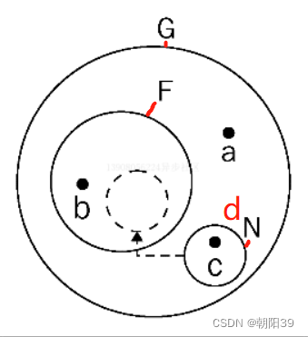

## 闭包

如果一个函数访问了此函数的父级及父级以上的作用域变量，那么这个函数就是闭包

```JavaScript
var a = 1;
// 匿名的立即执行函数，访问了全局变量 `a` ,所以该函数是一个闭包
(function(){
    alert(a)
})()
```

最常见的实现闭包的方式就是嵌套函数

```JavaScript
function a() {
    let i = 'hey'
    i = i + '_hh'
    function b() {
        i = i + '_bb'
        console.log(i)
    }
    return b
}
var c = a(); // 此时 i 的值为 ：初始值—_执行a
c()          // 此时 i 的值为 ：初始值—_执行a_执行b
c()          // 此时 i 的值为 ：初始值—_执行a_执行b_执行b
```

### 闭包的执行过程

1. 将函数 a 赋值给全局变量 c 时，a 会执行一次，局部变量 i 的值变为`初始值—\_执行 a`，最终返回函数 b，此时全局变量 c 的值为闭包函数 b 的引用。

> 此时函数 a 虽然已执行完，但因为内部包含`闭包函数` b，所以函数 a 的执行期上下文会继续保留在内存中，不会被销毁，所以局部变量 i 仍是`初始值—\_执行 a `
>
> **_执行期上下文_**：当函数执行时，会创建一个执行期上下文的内部对象。每调用一次函数，就会创建一个新的上下文对象，他们之间是相互独立的。当函数执行完毕，它所产生的执行期上下文会被销毁

2. 第一次执行 `c()` 时，闭包函数 b 第一次执行，局部变量 i 的值变为`初始值—执行 a执行 b`
3. 第二次执行 `c()` 时，闭包函数 b 第二次执行，局部变量 i 的值变为`初始值—执行 a 执行 b\_执行 b`

### 闭包执行图解



-   全局作用域 G 中有:  
    —— 函数 F  
    —— 全局变量 a  
    —— 全局变量 d （存有对闭包函数 N 的引用）
-   函数 F 中有: （返回闭包函数 N）  
    —— 函数 F 作用域中的局部变量  
    —— 闭包函数 N
-   闭包函数 N 中有: （返回局部变量 b）  
    —— 函数 N 作用域中的局部变量 c

### 闭包的特点

1. 被闭包函数访问的父级及以上的函数的局部变量（如范例中的局部变量 i ）会一直存在于内存中，不会被 JS 的`垃圾回收机制回收`。
2. 闭包函数实现了对其他函数内部变量的访问。（函数内部的变量对外是无法访问的，闭包通过这种变通的方法，实现了访问。）

### 闭包的优点

1. 可以减少全局变量的定义，避免全局变量的污染
2. 能够读取函数内部的变量
3. 在内存中维护一个变量，可以用做缓存

### 闭包的缺点

1. 造成内存泄露

    > 闭包会使函数中的变量一直保存在内存中，内存消耗很大，所以不能滥用闭包，否则会造成网页的性能问题，在 IE 中可能导致内存泄露。  
    > 解决方法——使用完变量后，手动将它赋值为 null；

2. 闭包可能在父函数外部，改变父函数内部变量的值。
3. 造成性能损失
    > 由于闭包涉及跨作用域的访问，所以会导致性能损失。  
    > 解决方法——通过把跨作用域变量存储在局部变量中，然后直接访问局部变量，来减轻对执行速度的影响
