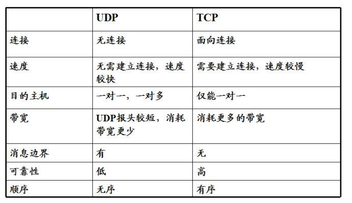
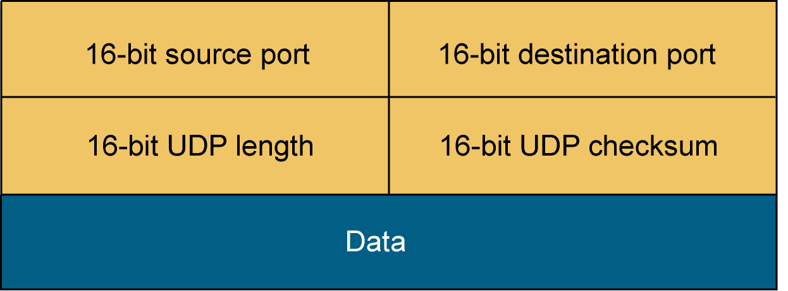

##  TCP/UDP

**TCP**: 传输层控制协议（英语: Transmission Control Protocol, 缩写是TCP）是一种面向连接的、可靠的、基于字节流的传输层通信协议，由IETF的RFC 793定义。

**UDP**: 用户数据报协议（英语: User Datagram Protocol,缩写UDP），又称使用者资料包协定，是一个简单的面向数据报的传输协议，正式规范为RFC 768。

###   1.TCP和UDP的异同点

####    1.1 相同点

UDP和TCP都属于传输层协议

####    1.2 不同点

**1.2.1 TCP面向字节流，UDP面向数据报**

解释：
TCP收发的是一堆数据，是一个数据流，而每次取多取少都是由主机决定。
UDP发的是数据报，客户发送多少接收多少

**1.2.2 TCP面连接，UDP不是面向连接**

解释：
TCP 是面向连接的，也就是说，在连接持续的过程中，socket中收到的数据都是由同一台主机发出的，因此，知道保证数据是有序的到达就行了，至于每次读取多少数据自己看着办。
UPD是无连接的协议，也就是说，只要知道收端的IP和端口，且网络是可达的，任何主机都可以向接收端发送数据。

**1.2.3 TCP是可靠的，UDP是不可靠的**

解释：
TCP为提供可靠性传输实行“顺序控制”或“重发控制”机制。此外还具备“流量控制”、“堵塞控制”、提高网络利用率等众多功能，并且只有确认通信端存在才会发送数据，从而控制通信流量的浪费。
UPD中，虽然可以确认发送信息的大小，却不能保证信息的一定会到达。因此，应有有时会根据自己的需要进行重发处理。UDP不提供复杂的控制机制，利用IP提供无面向连接的通信服务。他并不需要确认通信端是否存在，可以随时发送数据。

**1.2.4 TCP是全双工的，UDP支持多播和广播**

解释：
TCP是全双工的，所谓的全双工就是数据在两个方向上同时进行操作，例如我们打电话，说话的同时也能够听到对方的声音，一旦两个通信端口建立TCP连接，那么两个端口只能一对一进行数据传输。
UDP因为不需要一对一连接，所以他可以做到一对一，一对多等传输方式，承担广播或者多播，虽然他不会建立连接，但是会监听这个端口，谁都可以给这个端口传输数据，他也可以给任何人传输数据。

**1.2.5 UDP不处理堵塞，应用需要发送，就会发送；TCP还拥有堵塞控制，TCP会根据网络环境调整发包的频率。**

**1.2.6 TCP的传输效率低，UDP传输效率高**

解释：
因为UDP不用对收发的数据进行确认校验，有什么发什么，所以UDP的开销更小效率更高。

##  2.UDP协议解析

### 2.1 UDP包头

由上图可知，UDP的包头很简单，包含的字段有着：
-   16-bit source port (源端口 16位)
-   16-bit destination port(目标端口 16位)
-   16-bit UDP length(UDP长度 16位)
-   16-bit UDP checksum(UDP校验和字段 16位)

其中有用的就是源端口和目标端口，其中校验和字段是可选项，而**TCP数据段中的校验和字段是必须有的**

因为包头结构简单，所以决定了UDP功能上的简单。

### 2.2 UDP特点

1.  它不需要大量的数据结构，处理逻辑和包头字段，也就是说明它的通信方式很简单。
2.  UDP不会建立连接，但是会监听这个端口，这也决定了谁都可以向这个端口传输数据，并且他也可以给任何人数据，甚至**一对多传播（多播）**。
3.  UDP并不会根据网络状况进行堵塞控制，也不会对包进行校验，该怎么发怎么发。
4.  因为UDP的简单，所以UDP较TCP被攻击者利用的漏洞就要少一些。

##  3.TCP协议解析

### 3.1 TCP包头

由上图可知TCP包头较之于UDP复杂很多，TCP包含的字段有：
1.  **源、目端口号**：占16比特。TCP协议通过使用"端口"来标识源端和目标端的应用进程。

2.  **顺序号字段**：占32比特。用来标识从TCP源端向TCP目标端发送的数据字节流，他表示在这个报文段中的第一个数据节点。

3.  **确认好字段**：占32比特。只用ACK标志为1时，确认号字段才有效。它包含目标端收到源端的下一个数据字节。

4.  **首部长度字段**：占4比特。给出头部占32比特的数目。没有任何选项字段的TCP头部长度为20字节；最多可以有60字节的TCP头部。

5.  **标志位字段(U、A、P、R、S、F)**：占6比特。各比特的含义如下：
    -   URG：紧急确认指针(urgent pointer)有效；
    -   ACK：确认序号有效；
    -   PSH：接收方应该尽快将这个报文段交给应用层；
    -   RST：重新连接；
    -   SYN：发起一个连接；
    -   FIN：释放一个连接；

6.  **窗口大小字段**：占16比特。此字段用来进行**流量控制**。单位为字节数，这个值是本机期望一次接受的字段。

7.  **TCP校验和字段**：占16比特。对整个TCP报文段，即TCP头部和TCP数据进行校验和计算，并由目标端进行验证。

8.  **紧急指针字段**：占16比特。它是一个偏移量，和序号字段中的值相加表示紧急数据最后一个字节的序号。

9.  **选项字段**：占32比特。可能包括"窗口扩大"、"时间戳"等选项。

### 3.2 TCP的特点

因为有了较于复杂了多的包头，也让TCP的功能多样化，例如：

-   数据排序
-   数据检测确认，数据重发
-   连接维护
-   恢复丢失数据
-   流量控制和网络堵塞

