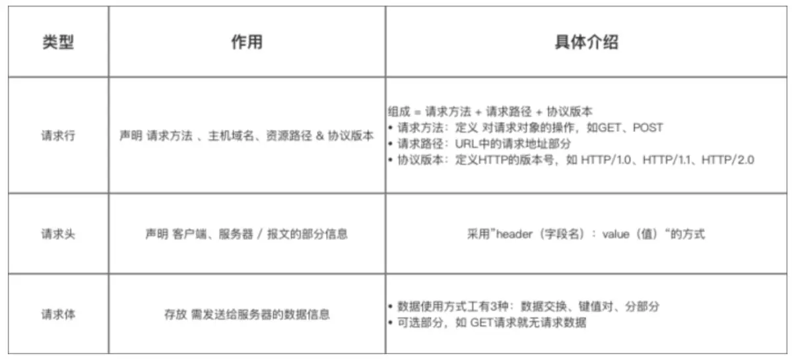
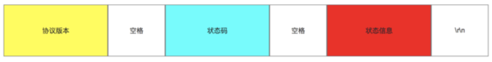
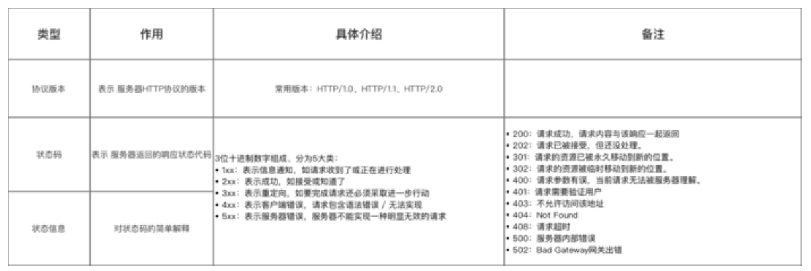
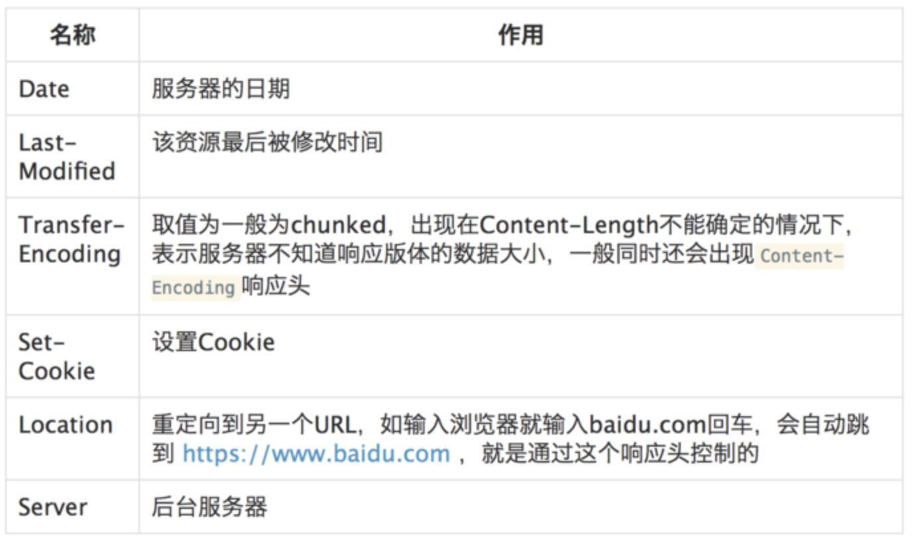
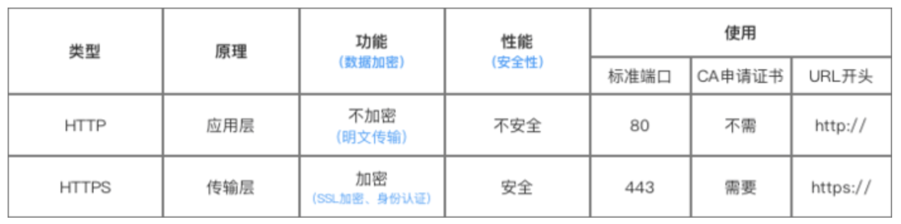

##   HTTP学习笔记
### 1.  HTTP简介
HTTP超文本传输协议适用于万维网服务器传输超文本到本地刘浏览器的协议，HTTP基于TCP/IP通信协议来传递数据（HTML文件、图片文件、查询结果等）。

通信传输协议一共分为四层（有的分为七层），应用层，传输层，网络层，链路层。

HTTP协议工作于客户端-服务器架构上，浏览器作为HTTP客户端通过URL向HTTP服务端即WEB服务器发送所有请求，WEB服务器有：Apache服务器，IIS服务器等。WEB服务器根据收到的请求向客户端发送响应消息，HTTP默认端口号为80，HTTPS为443.

1.  HTTP是无连接的：无连接指限制每次连接只处理一个请求，服务器处理完客户的请求，并收到客户的应答后，即断开连接，采用这种方式可以节省传输时间。
2.  HTTP是媒体独立的：只要客户端和服务器知道如何处理数据内容，人户类型的数据都可以通过HTTP发送，客户端以及服务器指定使用适合的MIME-type内容类型。
3.  HTTP是状态的：无状态指协议对于事务处理没有记忆能力，缺少状态意味着如果后续处理前面的信息，则他必须重传，这样可能导致每次连接的数据量增大，另一方面，在服务器不需要先前信息时它的应答就较快。

### 2.HTTP消息结构
1.  HTTP是基于客户端/服务端（C/S）的架构模型，通过一个可靠的链接（TCP）来交换信息，是一个无状态的请求/响应协议.

2.  一个HTTP客户端是一个应用程序，可以是WEB浏览器或其他客户端，通过连接到服务器达到向服务器发送一个或多个HTTP请求的目的；

3.  一个HTTP服务器同样也是一个应用程序，通常是一个WEB服务，如Apache web服务器或IIS服务器等，通过接受客户端的请求并向客户端发送HTTP响应数据；

4.  HTTP使用统一资源定位符（URI）来传输数据和建立数据连接；连接建立后，数据消息就通过类似Internet邮件所使用的格式[RFC5322]和多用途Internet邮件扩展（MIME）[RFC2045]来传送；

5.  http请求有八种方法：GET,POST,PUT,DELETE,HEAD,POTIONS,TRACE和CONNECT方法。
    1.  option: 返回服务器指针对特定资源所支持的HTML请求方法或web服务器发送测试服务器功能（允许客户端查看服务器性能）
    2.  GET: 向特定资源发起请求（请求指定页面信息，返回实体主体）
    3.  Post: 向特定资源提交数据进行处理请求（提交表单、上传文件），又可能导致新的资源的建立或原有资源的修改
    4.  Put: 向指定资源位置上上传最新内容（从客户端向服务器传送的数据取代指定文档的内容）
    5.  Head: 与服务器中的Get请求一致的相应，响应提不会返回，获取包含在小消息头中的原信息（与Get请求相似，返回的响应中没有具体内容，用户获取报头）
    6.  Delete: 请求服务器删除request-URL所表示的资源（请求服务器删除页面）
    7.  Trace: 回显服务器收到的请求，用于测试和诊断
    8.  Connect: HTTP/1.1协议中能够将连接改为管道方式的代理服务器

6.  Contect-Type：内容类型，指网页中存在的Contect-Type，用于定义网络类型和网页的编码，决定浏览器将以什么形式，什么编码读取这个文件；

7.  HTTP请求报文：请求行+请求头+请求体；

### 3.组成一：请求行
1.  作用：声明请求方法、主机域名、资源路径和协议版本；
2.  结构：请求行的组成：请求方法+请求路径+协议版本；**注意：空格不能省略**

请求介绍：

get和post的区别：

举例：设请求报文采用GET方法，URL地址：

http://www.tsinghua.edu.cn/chn/yxsz/index.htm, HTTP1.1版本

则 请求行为：

GET /chn/yxsz/index.htm HTTP/1.1

### 4.组成二：请求头

1.  作用：声明客户端，服务器/报文的部分信息；
2.  使用方法： 采用“header（字段名）: value（值）”的方式
3.  常用请求头：
    1.  请求和响应报文通用Header。

|名称|作用|
|-|-|
|Contect-type|请求体/响应体，如: text/plain, application/json|
|Accept|说明接受的类型， 可以多个值，用 `,` (半角逗号)分开|
|Content-Length|请求体/响应体的长度，单位字节|
|Content-Encoding|请求体/响应体的编码格式，如gzip,deflate|
|Accept-Encoding|告知对方我方接受的Content-Encoding|
|ETag|给当前资源的标识，和 `Last-Modified`, `If-None-Match`, `If-Modified-Since`配合，用于缓存控制|
|Cache-Control|取值为一般为`no-cache`或`max-age=XX`,XX为个整数，表示资源缓存有效期(秒)|

3.2.  常见的请求Header

|名称|作用|
|-|-|
|Authorization|用于设置身份认证信息|
|User-Agent|用户标识，如：OS和浏览器的类型和版本|
|If-Modified-Since|值为上一次服务器返回的`Last-Modified`值，用于确认某个资源是否被更改过，没有更改过（304）就从缓存中读取|
|If-None-Match|值为上一次服务器返回的ETag值，一般会和`If-Modified-Since`一起出现|
|Cookie|已有的Cookie|
|Referer|表示请求引用自哪个地址，比如你从页面A跳转到页面B时，值为A的地址|
|Host|请求的主机和端口号|

3.3：应用举例：
（URL地址：http://www.tsinghua.edu.cn/chn/yxsz/index.htm）

Host: www.tsinghua.edu.cn (表示主机域名）

User-Agent: Mozilla/5.0(表示用户代理是使用Netscape浏览器)

### 组成三：请求体
1.  作用：存放需发送给服务器的数据信息；可选部分，如GET请求无请求数据；

总结：

### HTTP响应报文：状态行+响应头+响应体

####  组成一：状态行

1.  作用：声明协议版本、状态码、状态码描述。
2.  组成：状态行、状态码和状态信息组成

**注：空格不能省略**

具体介绍：

状态行实例：
`HTTP/1.1 202 Accepted(接受)、HTTP/1.1 404 Not Found(找不到)`

#### 组成二：响应头

1.  作用：声明客户端、服务器/报文的部分信息；
2.  使用方式：采用“header(字段名):value(值)”的方式；
3.  常用响应头：
    1.请求和响应报文的通用header

|名称|作用|
|-|-|
|Contect-type|请求体/响应体，如: text/plain, application/json|
|Accept|说明接受的类型， 可以多个值，用 `,` (半角逗号)分开|
|Content-Length|请求体/响应体的长度，单位字节|
|Content-Encoding|请求体/响应体的编码格式，如gzip,deflate|
|Accept-Encoding|告知对方我方接受的Content-Encoding|
|ETag|给当前资源的标识，和 `Last-Modified`, `If-None-Match`, `If-Modified-Since`配合，用于缓存控制|
|Cache-Control|取值为一般为`no-cache`或`max-age=XX`,XX为个整数，表示资源缓存有效期(秒)|

####    组成三：响应体
1.  作用：存放需返回给客户端的数据信息；
2.  使用方式：和请求体是一致的，同样分为：任意类型的数据交换格式、键值对形式和分部分形式；

响应报文总结：

##  三、HTTP和HTTPS的区别

**HTTP：**
是超文本传输协议，是进行的明文传输；
HTTP的连接是无状态的，连接很简单
HTTP连接的端口是80；
HTTP不需要CA申请证书；

**HTTPS：**
是具有安全性的SSL加密传输协议；
HTTPS协议是由SSL+HTTP协议构建的可进行加密传输、身份认证的网络协议，
对比HTTP是更为的安全；
HTTPS连接的端口是443；
HTTPS需要CA申请证书，因为免费证书一般较少，苏一需要一定的费用；

##  HTTP协议状态码学习
https://www.jianshu.com/p/7b422a428c72