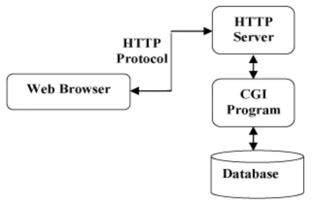

##   HTTP学习笔记
### 1.  HTTP简介
HTTP超文本传输协议适用于万维网服务器传输超文本到本地刘浏览器的协议，HTTP基于TCP/IP通信协议来传递数据（HTML文件、图片文件、查询结果等）。

通信传输协议一共分为四层（有的分为七层），应用层，传输层，网络层，链路层。

HTTP协议工作于客户端-服务器架构上，浏览器作为HTTP客户端通过URL向HTTP服务端即WEB服务器发送所有请求，WEB服务器有：Apache服务器，IIS服务器等。WEB服务器根据收到的请求向客户端发送响应消息，HTTP默认端口号为80，HTTPS为443.

1.  HTTP是无连接的：无连接指限制每次连接只处理一个请求，服务器处理完客户的请求，并收到客户的应答后，即断开连接，采用这种方式可以节省传输时间。
2.  HTTP是媒体独立的：只要客户端和服务器知道如何处理数据内容，人户类型的数据都可以通过HTTP发送，客户端以及服务器指定使用适合的MIME-type内容类型。
3.  HTTP是状态的：无状态指协议对于事务处理没有记忆能力，缺少状态意味着如果后续处理前面的信息，则他必须重传，这样可能导致每次连接的数据量增大，另一方面，在服务器不需要先前信息时它的应答就较快。

### 2.HTTP消息结构
1.  HTTP是基于客户端/服务端（C/S）的架构模型，通过一个可靠的链接（TCP）来交换信息，是一个无状态的请求/响应协议.

2.  一个HTTP客户端是一个应用程序，可以是WEB浏览器或其他客户端，通过连接到服务器达到向服务器发送一个或多个HTTP请求的目的；

3.  一个HTTP服务器同样也是一个应用程序，通常是一个WEB服务，如Apache web服务器或IIS服务器等，通过接受客户端的请求并向客户端发送HTTP响应数据；

4.  HTTP使用统一资源定位符（URI）来传输数据和建立数据连接；连接建立后，数据消息就通过类似Internet邮件所使用的格式[RFC5322]和多用途Internet邮件扩展（MIME）[RFC2045]来传送；

5.  http请求有八种方法：GET,POST,PUT,DELETE,HEAD,POTIONS,TRACE和CONNECT方法。

6.  Contect-Type：内容类型，指网页中存在的Contect-Type，用于定义网络类型和网页的编码，决定浏览器将以什么形式，什么编码读取这个文件；

7.  HTTP请求报文：请求行+请求头+请求体；

